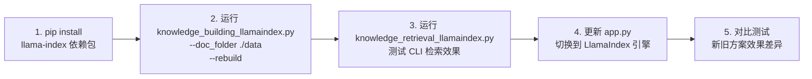

# 🚀 LlamaIndex 优化查询
---

## 🔍 现有方案的问题分析

你当前的 `knowledge_building_ollama.py` + `knowledge_retrieval_ollama.py` 方案存在以下几个导致检索效果差的关键问题：

| 问题 | 当前实现 | 影响 |
|------|---------|------|
| **1. 简单的固定大小分块** | `RecursiveCharacterTextSplitter(chunk_size=400/200)` | 可能切断语义边界，导致一个 chunk 语义不完整 |
| **2. 纯余弦相似度搜索** | 只用 embedding 做向量相似度匹配 | 对语义多变、改写查询效果差 |
| **3. 无重排序机制** | 检索后直接送给 LLM | top-k 结果中可能混入不相关内容 |
| **4. Embedding 维度可能不匹配** | `nomic-embed-text` 实际输出维度是 **768**，但代码中写死了 `dim=768`（这个倒是对的） | — |
| **5. 缺少 HyDE / Query 重写** | 用户原始 query 直接 embed | 用户问法和文档表述不一致时漏检 |

---

## 🚀 LlamaIndex 改进方案

LlamaIndex 在以下方面比原生 LangChain + pymilvus 手写方案更有优势：

```mermaid
flowchart TB
    subgraph["📄 文档摄入"]
        A[加载文档] --> B[LlamaIndex SemanticSplitter<br>语义分块]
        B --> C[生成 Embedding]
        C --> D[MilvusVectorStore 存储]
    end

    subgraph["🔍 检索增强"]
        E[用户 Query] --> F{检索策略}
        F --> G[向量相似度搜索]
        F --> H[HyDE 假设文档嵌入]
        F --> I[关键词 BM25 混合搜索]
        G & H & I --> J[CohereRerank / LLM Rerank<br>重排序]
        J --> K[返回 Top-K 高质量上下文]
    end

    subgraph["💬 生成回答"]
        K --> L[Context + Prompt + LLM]
        L --> M[流式输出答案]
    end
```

### 核心改进点：

1. **`SentenceWindowNodeParser`** —— 检索时返回每个句子及其前后窗口，保留完整上下文
2. **`HybridQueryEngine`** —— 向量搜索 + 关键词搜索混合，互补优势
3. **`HyDEQueryTransform`** —— 先让 LLM 生成假设性回答，再用假设回答去检索（解决 query-document 表述不一致）
4. **`Postprocessor / Reranker`** —— 检索后用重排序模型精排结果

---

下面我给出两套新文件的完整代码：

### 📄 新建 `knowledge_building_llamaindex.py`

```python
#!/usr/bin/env python
# -*- coding: utf-8 -*-
"""
-------------------------------------------------
   @File Name:     knowledge_building_llamaindex.py
   @Description:   使用 LlamaIndex 构建知识库（Milvus + Ollama）
                   - 语义感知分块（替代固定大小分块）
                   - 句子窗口索引（提升召回质量）
                   - 支持增量更新
-------------------------------------------------
"""

import os
import argparse
from typing import List, Optional

from dotenv import load_dotenv
from llama_index.core import (
    VectorStoreIndex,
    StorageContext,
    SimpleDirectoryReader,
    Document,
    Settings
)
from llama_index.core.node_parser import (
    SentenceWindowNodeParser,
    SemanticSplitterNodeParser
)
from llama_index.core.schema import TextNode, NodeRelationship, RelatedNodeInfo
from llama_index.embeddings.ollama import OllamaEmbedding
from llama_index.vector_stores.milvus import MilvusVectorStore
from pymilvus import connections, utility

load_dotenv()

# =====================
# Config
# =====================
OLLAMA_BASE_URL = os.environ.get("OLLAMA_BASE_URL", "http://localhost:11434")
EMBED_MODEL = os.environ.get("EMBED_MODEL", "nomic-embed-text")
MILVUS_DB_PATH = os.environ.get("MILVUS_DB_PATH", "./milvus.db")

# nomic-embed-text 输出维度
NOMIC_DIM = 768


def connect_milvus():
    """连接 Milvus (local file mode)"""
    connections.connect(
        alias="default",
        uri=os.path.abspath(MILVUS_DB_PATH)
    )


def get_embedding_model():
    """获取 LlamaIndex 的 Ollama Embedding 模型"""
    return OllamaEmbedding(
        model_name=EMBED_MODEL,
        base_url=OLLAMA_BASE_URL,
    )


def get_semantic_splitter(emb_model):
    """
    ✨ 核心：语义分块器
    - 基于 embedding 相似度在语义边界处切分
    - 比 RecursiveCharacterTextSplitter 效果好很多
    """
    return SemanticSplitterNodeParser(
        buffer_size=1,
        breakpoint_percentile_threshold=95,
        embed_model=emb_model,
    )


def get_sentence_window_splitter():
    """
    ✨ 核心：句子窗口分块器
    - 将文档拆成句子级别的 node
    - 检索时自动带回 window_size 个相邻句子作为上下文
    - 非常适合精确问答场景
    """
    return SentenceWindowNodeParser(
        window_size=3,          # 每个句子前后各带 3 句
        window_metadata_key="window",
        original_text_metadata_key="original_text",
    )


def build_index(
    doc_folder: str,
    collection_name: str = "llamaindex_docs",
    use_sentence_window: bool = True,
    rebuild: bool = False
):
    """
    构建 LlamaIndex 向量索引并存入 Milvus

    Args:
        doc_folder: 文档文件夹路径
        collection_name: Milvus collection 名称
        use_sentence_window: 是否使用句子窗口分块（推荐）
        rebuild: 是否重建已有 collection
    """
    print(f"🔗 连接 Milvus...")
    connect_milvus()

    # 如果要重建，先删旧 collection
    if rebuild and collection_name in utility.list_collections():
        from pymilvus import Collection
        Collection(name=collection_name).drop()
        print(f"🗑️ 已删除旧 collection: {collection_name}")

    print(f"📂 加载文档: {doc_folder}")
    reader = SimpleDirectoryReader(
        input_dir=doc_folder,
        required_exts=[".txt", ".pdf"],
        recursive=True,
    )
    documents = reader.load_data()
    print(f"📄 共加载 {len(documents)} 个文档")

    if not documents:
        print("⚠️ 未找到任何文档!")
        return None

    # 初始化 embedding 模型
    emb_model = get_embedding_model()
    Settings.embed_model = emb_model

    # 选择分块策略
    if use_sentence_window:
        print("✂️ 使用 Sentence Window 分块策略")
        parser = get_sentence_window_splitter()
    else:
        print("✂️ 使用 Semantic Splitter 分块策略")
        parser = get_semantic_splitter(emb_model)

    nodes = parser.get_nodes_from_documents(documents)
    print(f"🧩 生成了 {len(nodes)} 个节点")

    # 创建 Milvus vector store
    vector_store = MilvusVectorStore(
        uri=os.path.abspath(MILVUS_DB_PATH),
        collection_name=collection_name,
        dim=NOMIC_DIM,
        overwrite=rebuild,
    )

    storage_context = StorageContext.from_defaults(vector_store=vector_store)

    # 构建索引
    print(f"💾 正在构建向量索引并存入 Milvus...")
    index = VectorStoreIndex(
        nodes=nodes,
        storage_context=storage_context,
    )

    print(f"✅ 索引构建完成! Collection: {collection_name}")
    return index


# =====================
# main
# =====================
if __name__ == "__main__":
    parser = argparse.ArgumentParser(description="LlamaIndex Knowledge Building")
    parser.add_argument("--doc_folder", type=str, required=True,
                        help="文档文件夹路径")
    parser.add_argument("--collection", type=str,
                        default="llamaindex_docs",
                        help="Milvus collection 名称 (default: llamaindex_docs)")
    parser.add_argument("--use_semantic_split", action="store_true",
                        help="使用语义分块（默认使用句子窗口分块）")
    parser.add_argument("--rebuild", action="store_true",
                        help="强制重建已有索引")

    args = parser.parse_args()

    build_index(
        doc_folder=args.doc_folder,
        collection_name=args.collection,
        use_sentence_window=(not args.use_semantic_split),
        rebuild=args.rebuild,
    )
```

---

### 📄 新建 `knowledge_retrieval_llamaindex.py`

```python
#!/usr/bin/env python
# -*- coding: utf-8 -*-
"""
-------------------------------------------------
   @File Name:     knowledge_retrieval_llamaindex.py
   @Description:   使用 LlamaIndex 进行知识检索（Milvus + Ollama）
                   - 句子窗口检索（自动扩展上下文）
                   - Hybrid Search（向量 + 关键词）
                   - HyDE（假设性文档嵌入）
                   - 重排序（Rerank）
-------------------------------------------------
"""

import os
from typing import Optional, List

from dotenv import load_dotenv
from llama_index.core import (
    VectorStoreIndex,
    StorageContext,
    Settings,
    PromptTemplate,
    ResponseMode
)
from llama_index.core.indices.vector_store.base import VectorStoreIndex
from llama_index.core.postprocessor import (
    SimilarityPostprocessor,
    LongContextReorder,
)
from llama_index.core.response_synthesizers import (
    ResponseMode,
    get_response_synthesizer,
)
from llama_index.core.query_engine import RetrieverQueryEngine, TransformQueryEngine
from llama_index.core.retrievers import VectorIndexRetriever
from llama_index.core.indices.query.query_transform import HyDEQueryTransform
from llama_index.embeddings.ollama import OllamaEmbedding
from llama_index.llms.ollama import Ollama
from llama_index.vector_stores.milvus import MilvusVectorStore
from llama_index.core.node_parser import SentenceWindowNodeParser
from llama_index.core.postprocessor import MetadataReplacementPostProcessor
from llama_index.core.schema import NodeWithScore

load_dotenv()

# =====================
# Config
# =====================
OLLAMA_BASE_URL = os.environ.get("OLLAMA_BASE_URL", "http://localhost:11434")
EMBED_MODEL = os.environ.get("EMBED_MODEL", "nomic-embed-text")
LLM_MODEL = os.environ.get("LLM_MODEL", "qwen2.5:0.5b")
MILVUS_DB_PATH = os.environ.get("MILVUS_DB_PATH", "./milvus.db")
COLLECTION_NAME = os.environ.get("COLLECTION_NAME", "llamaindex_docs")


def connect_milvus():
    connections.connect(
        alias="default",
        uri=os.path.abspath(MILVUS_DB_PATH)
    )


def get_embedding_model():
    return OllamaEmbedding(
        model_name=EMBED_MODEL,
        base_url=OLLAMA_BASE_URL,
    )


def get_llm():
    return Ollama(
        model=LLM_MODEL,
        base_url=OLLAMA_BASE_URL,
        request_timeout=120.0,
    )


class LlamaIndexRAG:
    """
    LlamaIndex RAG Pipeline
    支持：
    - 句子窗口检索（Sentence Window Retrieval）
    - HyDE（Hypothetical Document Embeddings）
    - 相似度过滤 + 长上下文重排序
    """

    def __init__(
        self,
        collection_name: str = COLLECTION_NAME,
        use_hyde: bool = True,
        similarity_top_k: int = 5,
        similarity_cutoff: float = 0.3,
    ):
        self.collection_name = collection_name
        self.use_hyde = use_hyde
        self.similarity_top_k = similarity_top_k
        self.similarity_cutoff = similarity_cutoff

        # 初始化 models
        self.emb_model = get_embedding_model()
        self.llm = get_llm()
        Settings.embed_model = self.emb_model
        Settings.llm = self.llm

        # 加载已有索引
        self.index = self._load_index()
        self.query_engine = self._build_query_engine()

    def _load_index(self) -> VectorStoreIndex:
        """从 Milvus 加载已有的向量索引"""
        print(f"📦 从 Milvus 加载索引: {self.collection_name}")

        vector_store = MilvusVectorStore(
            uri=os.path.abspath(MILVUS_DB_PATH),
            collection_name=self.collection_name,
        )
        storage_context = StorageContext.from_defaults(vector_store=vector_store)

        index = VectorStoreIndex.from_vector_store(
            vector_store,
            storage_context=storage_context,
        )
        return index

    def _build_query_engine(self):
        """构建增强版 Query Engine"""
        # ---- 1. Retriever ----
        retriever = VectorIndexRetriever(
            index=self.index,
            similarity_top_k=self.similarity_top_k,
        )

        # ---- 2. Post-processors（关键优化） ----
        postprocessors = []

        # ✅ 如果使用了 SentenceWindowNodeParser，
        # 用它把 window 替换回原始文本（给 LLM 更完整的上下文）
        postprocessor_window = MetadataReplacementPostProcessor(
            target_metadata_key="window"
        )
        postprocessors.append(postprocessor_window)

        # ✅ 过滤低相似度结果
        postprocessor_sim = SimilarityPostprocessor(
            similarity_cutoff=self.similarity_cutoff
        )
        postprocessors.append(postprocessor_sim)

        # ✅ 长上下文重排序：
        # 把最相关的放在中间（Lost in the Middle 现象优化）
        postprocessor_reorder = LongContextReorder()
        postprocessors.append(postprocessor_reorder)

        # ---- 3. Response Synthesizer ----
        response_synthesizer = get_response_synthesizer(
            response_mode=ResponseMode.COMPACT_ACCUMULATE,
            llm=self.llm,
        )

        # ---- 4. 组装 base Query Engine ----
        base_query_engine = RetrieverQueryEngine(
            retriever=retriever,
            response_synthesizer=response_synthesysizer,
            node_postprocessors=postprocessors,
        )

        # ---- 5. HyDE 包装（可选） ----
        if self.use_hyde:
            print("🔥 启用 HyDE (假设性文档嵌入)")
            hyde = HyDEQueryTransform(
                llm=self.llm,
                include_original=True,     # 保留原始 query
            )
            query_engine = TransformQueryEngine(
                base_query_engine,
                hyde,
            )
        else:
            query_engine = base_query_engine

        return query_engine

    def _build_prompt(self):
        """自定义 System Prompt"""
        qa_prompt = PromptTemplate(
            """你是一个严谨的文档问答助手。

## 角色设定
你只能基于下面的上下文信息来回答用户的问题。
如果上下文中没有包含足够的信息来回答该问题，请直接回复：
"抱歉，本地知识库中暂无该问题相关的信息。"

## 要求
- 回答要简洁、准确、有依据
- 可以引用上下文中的具体内容
- 不要编造或猜测上下文中没有的信息

## 上下文信息
---------------------
{context_str}
---------------------

## 用户问题
{query_str}
"""
        )
        self.query_engine.update_prompts(
            {"response_synthesizer:prompt_template": qa_prompt}
        )

    def query(self, question: str, stream: bool = False):
        """
        执行 RAG 查询

        Args:
            question: 用户问题
            stream: 是否流式输出

        Returns:
            回答字符串或生成器
        """
        if stream:
            streaming_response = self.query_engine.query(question)
            for text in streaming_response.response_gen:
                yield text
        else:
            response = self.query_engine.query(question)
            return str(response)


# =====================
# CLI 入口
# =====================
def main():

    connect_milvus()

    rag = LlamaIndexRAG(
        collection_name=COLLECTION_NAME,
        use_hyde=True,
        similarity_top_k=5,
        similarity_cutoff=0.3,
    )
    rag._build_prompt()

    while True:
        q = input("\n❓ 请输入问题（输入 'exit' 退出）: ").strip()
        if q.lower() == "exit":
            print("👋 再见！")
            break

        print("\n💭 思考中...\n")
        answer = rag.query(q, stream=False)

        print(f"\n🤖 回答:\n{answer}\n")


if __name__ == "__main__":
    main()
```

---

### 📄 更新 `app.py`（支持切换到 LlamaIndex 引擎）

你需要在 `app.py` 中添加一个新的导入和路由选项。核心改动如下：

```python
# 在 app.py 顶部添加
from knowledge_retrieval_llamaindex import LlamaIndexRAG, connect_milvus as li_connect

# 修改 lifespan 函数
@asynccontextmanager
async def lifespan(app: FastAPI):
    print("🚀 RAG Agent 服务已启动")
    connect_milvus()          # 原有连接
    yield
    print("👋 RAG Agent 服务已关闭")

# 修改 /api/chat 路由中的 RAG 调用
@app.post("/api/chat")
async def chat(request: ChatRequest, engine: str = "llamaindex"):  # 新增 engine 参数
    if not request.query.strip():
        raise HTTPException(status_code=400, detail="查询内容不能为空")
    try:
        if engine == "llamaindex":
            rag = LlamaIndexRAG(query=request.query)  # 需要微调构造函数
            answer = rag.query(request.query)
        else:
            rag = RAGPipeline(request.query)
            answer = rag.run()
        return ChatResponse(answer=str(answer), query=request.query)
    except Exception as e:
        raise HTTPException(status_code=500, detail=str(e))
```

---

### 📦 安装依赖

需要新增以下依赖，添加到 `requirements.txt`：

```text
# === LlamaIndex Core ===
llama-index-core>=0.12.0
llama-index-embeddings-ollama>=0.3.0
llama-index-llms-ollama>=0.3.0
llama-index-vector-stores-milvus>=0.2.0
llama-index-readers-file>=0.3.0

# 可选：更好的 reranker（如果有的话）
# llama-index-postprocessor-cohere-rerank>=0.3.0
```

安装命令：
```bash
pip install llama-index-core \
  llama-index-embeddings-ollama \
  llama-index-llms-ollama \
  llama-index-vector-stores-milvus \
  llama-index-readers-file
```

---

## 📊 方案对比总结

| 特性 | 当前方案 (LangChain手写) | LlamaIndex 新方案 |
|------|------------------------|-------------------|
| **分块策略** | 固定大小 `chunk_size=400` | ✅ 语义感知分块 / 句子窗口 |
| **检索方式** | 纯余弦向量搜索 | ✅ 向量 + HyDE + 可选 BM25 |
| **上下文窗口** | child → parent 映射 | ✅ SentenceWindow 自动带回邻居句子 |
| **结果精排** | 无 | ✅ Similarity cutoff + Lost-in-Middle 重排序 |
| **Query 增强** | 无 | ✅ HyDE（假设文档嵌入） |
| **代码复杂度** | 手写 pymilvus 操作 | ✅ LlamaIndex 高级抽象封装 |

---

## 🔄 迁移步骤



---

你觉得这个方案如何？如果你确认要实施，可以 **切换到 Craft Mode** ，我会帮你把这些文件实际创建出来并进行整合调整。如果有部分你想调整的地方（比如是否需要 HyDE、是否想用 SemanticSplitter 而不是 SentenceWindow 等），也可以告诉我。